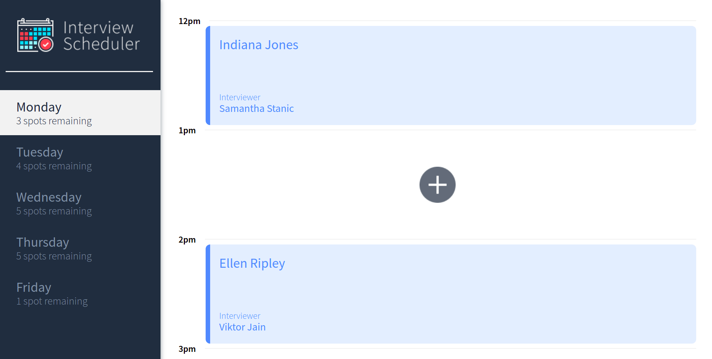
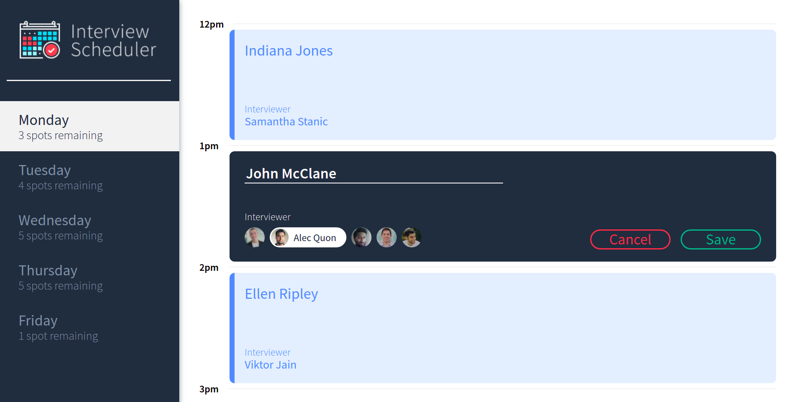
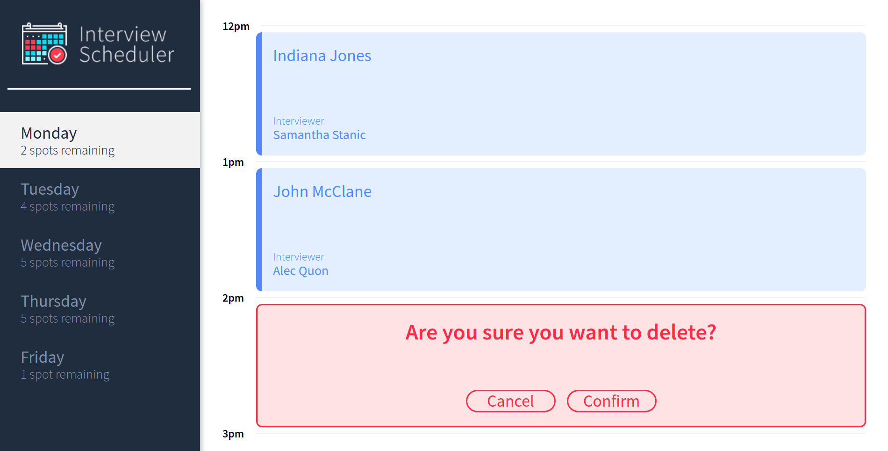
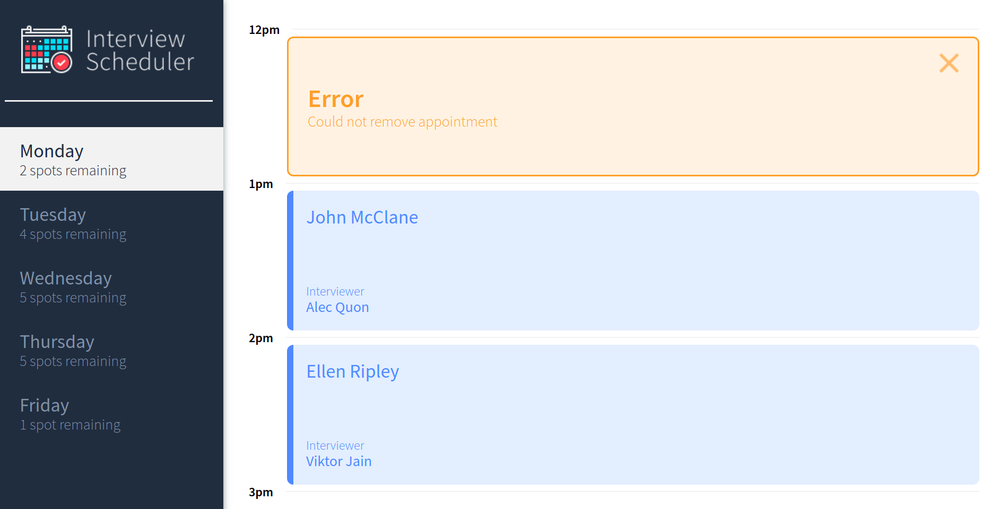

# Interview Scheduler

Interview Scheduler is a single-page-app allowing a user to see all available and booked appointments between Monday and Friday along
with the ability to add, edit, or delete an appointment.

It was built with React and tested using Storybook, Jest, and Cypress.

## Final Product





## Setup

Install dependencies with `npm install`.

## Running Webpack Development Server

```sh
npm start
```

## Running Jest Test Framework

```sh
npm test
```

## Running Storybook Visual Testbed

```sh
npm run storybook
```

## Notes
You will need to run a separate server for the API data. 